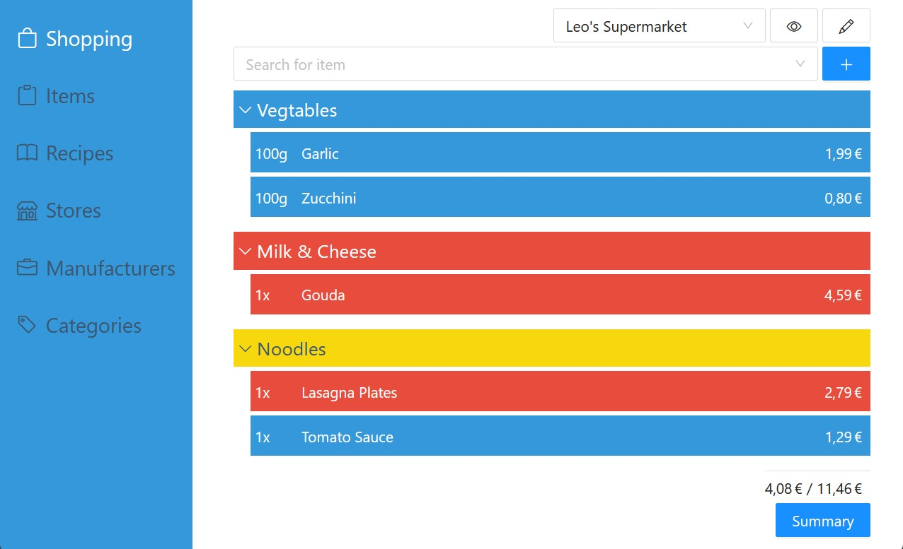
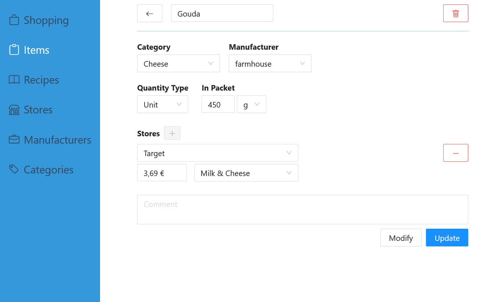
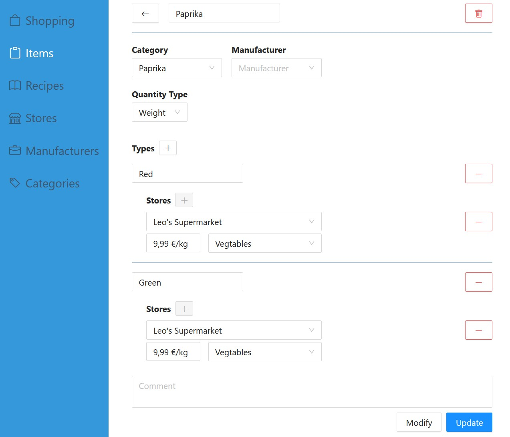
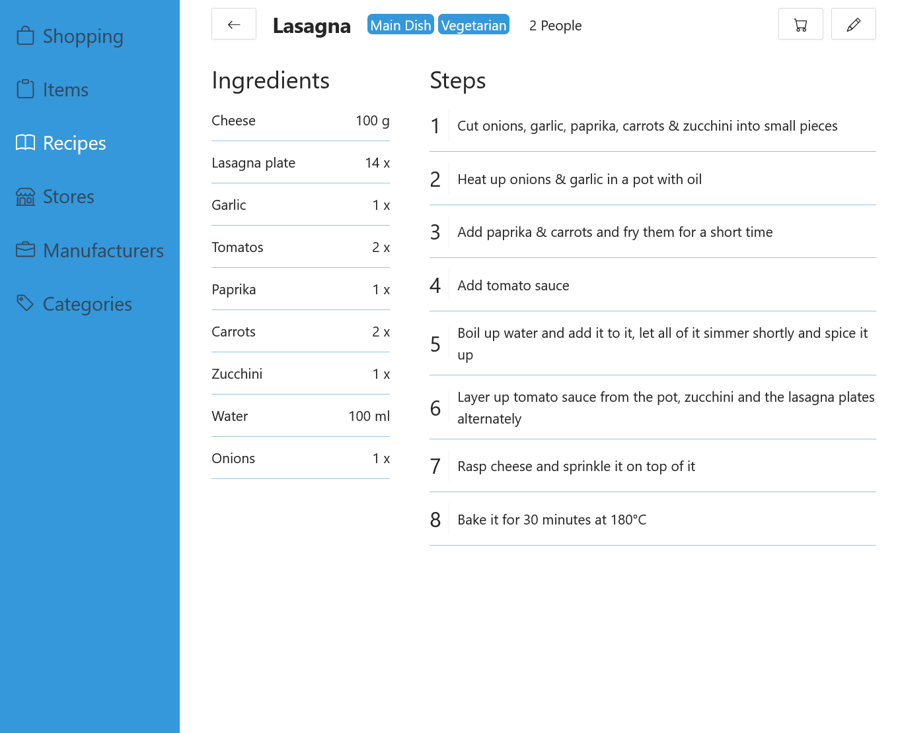
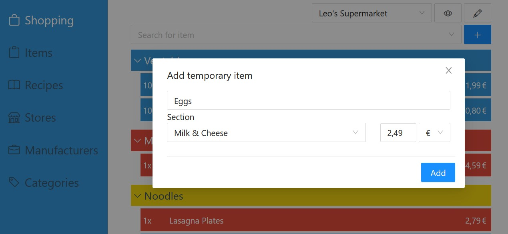
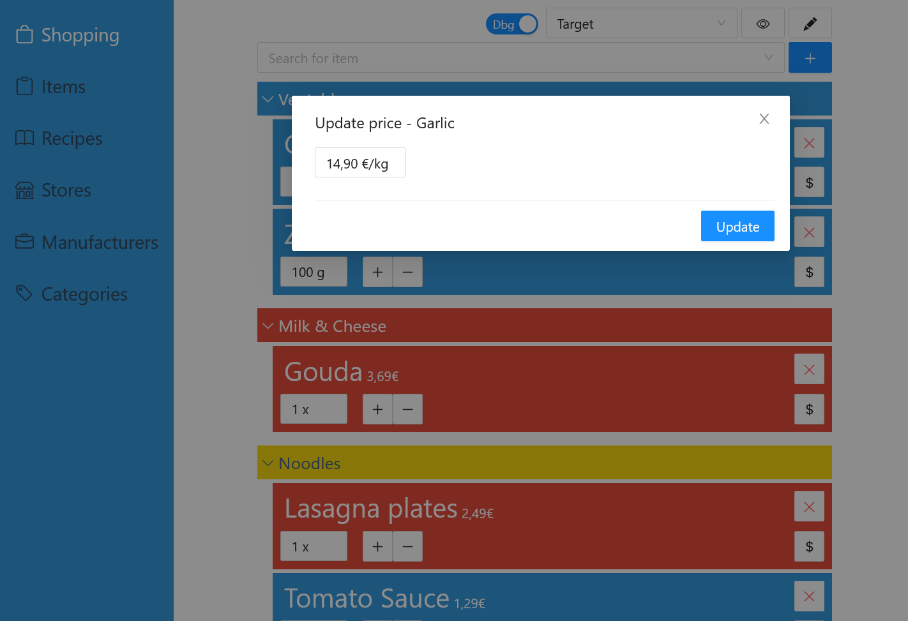
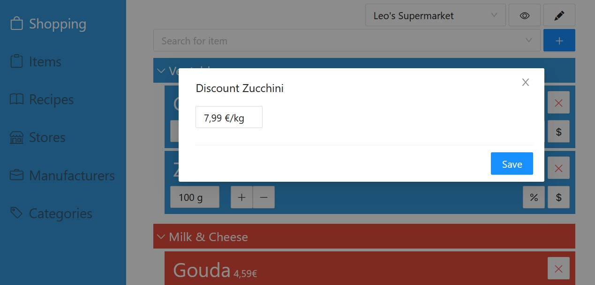
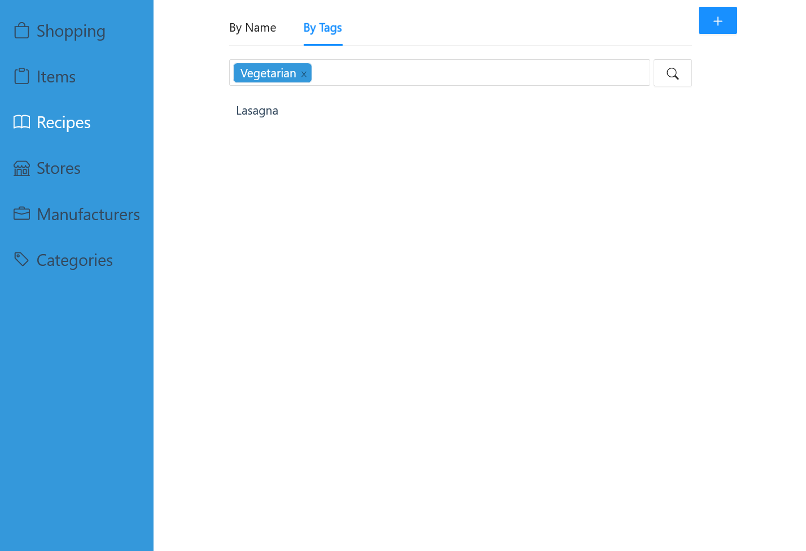
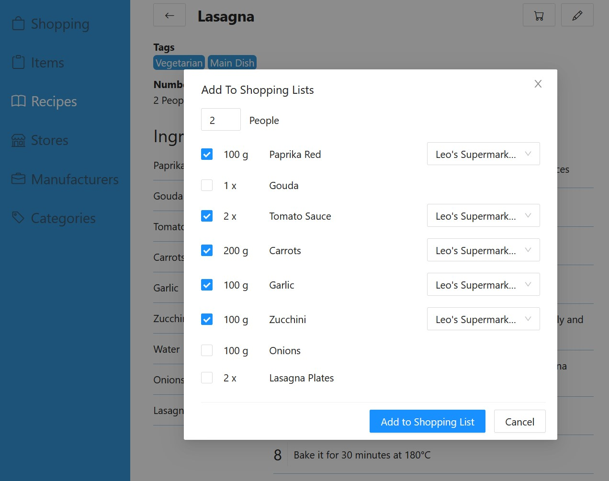

# Xipona

[](https://hub.docker.com/repository/docker/velocir4ptor/xipona-api)
[](https://hub.docker.com/repository/docker/velocir4ptor/xipona-frontend)

> **For docs & instructions on the latest stable release, switch to *main* branch please**

## Description

With Xipona you can create **shopping lists**, manage your bought **items** and collect your favorite **recipes**.
Thanks to queuing and retry logic, you don't have to worry about losing internet connection while grocery shopping - the app will **sync all changes** of your shopping list once you're online again.

### Go Shopping

Your items are **sorted conveniently** by the store's section in which they are located, so that you can take your usual stroll through the aisles and see at one glance what you need to pick up. To make it even easier, you can **hide all items in the basket** to only see what's left to buy.</br>
One of the items you needed was out of stock? No problem, the shopping list will **transfer all items** that you haven't marked as "in basket" to the next shopping list upon finishing the current one.



### Manage items

You can create simple items ...



... or register multiple types per item, so you don't have to create a separate item for every individual type.



(Modifying an item will alter the current revision, e.g. when you made a typo in the name. Updating the item will create a new revision of it, e.g. when the price changes. With this concept, you keep the item prices for previous shopping lists)

### Create Recipes

Save your best recipes along with all the ingredients and instructions




### And more

And that was just the general overview.
Because not everyone wants to have certain items permanently show up for shopping, you can also create temporary items. These will only be available for this one store until you finish the shopping list with said item in the basket or remove it from the list



Depending on the prices you saved for the items, the shopping lists calculates the estimated costs of your shopping errand. But because prices change, you can quickly adjust them from the shopping list without having to laboriously search for & open the item in the item editor.



If the item is discounted for a short time, you can also register this - without having to changing the normal price.



**Search for recipes** not only by their name, but also by their tag. You'd like to eat vegetarian? Great! Search by the tag select the recipe you want to cook.



But what if you're missing some ingredients? It's tedious to add all of them to the shopping lists individually. That's why you can **add with one click** all of the ones that you're lacking to the respective store's shopping list.



And there is more on the horizon! Check out the [GitHub Milestones](https://github.com/Velociraptor45/Xipona/milestones) to get a glimps at what's coming soon 👀

## Setup in Docker
To run all required services in containers, Docker images and docker-compose files are provided for both `docker compose` and `docker stack deploy`. They can be found under *Docker/Compose*.

### Prerequisits
Prepare the following things:
- Docker Volumes
  - xipona-database
- Docker Secrets (if you're using stack deploy)
  - xipona-db-username
  - xipona-db-password

### Api

- In order to not get CORS issues, fill `XIPONA_CORS_ORIGIN__0` with the frontend's base URL. In the unlikely case that you have multiple URLs, duplicate the env variable and increment the number at the end.

### Frontend

Set the correct `XIPONA_API_URL`. Keep in mind that the frontend is a Webassembly application and runs fully on the client, thus `http://Api:80/v1` will not work.

Start the containers via e.g. `docker stack deploy --compose-file docker-compose-stack-deploy.yml xipona` or `docker compose -f docker-compose.yml -p xipona up -d`.
And now you're done. Happy shopping!

## Optional Setup

### https
If you don't want to run the application behind a reverse proxy that handles the certificate for you, you can also configure the application for https.

#### Api
1. Create the docker volume xipona-api-**tls** and uncomment the line in the docker compose file where it's mapped as a volume.
2. Generate the certificate and copy the files (\<cert-name\>.crt & \<cert-key-name\>.key) into the root directory of the xipona-api-**tls** volume.
3. Add the following env variables (or [any other valid ones](https://learn.microsoft.com/en-us/aspnet/core/fundamentals/servers/kestrel/endpoints?view=aspnetcore-7.0#replace-the-default-certificate-from-configuration)):
- `Kestrel__Endpoints__HttpsInlineCertAndKeyFile__Url: https://0.0.0.0:12489`
- `Kestrel__Endpoints__HttpsInlineCertAndKeyFile__Certificate__Path: ssl/<cert-name>.crt`
- `Kestrel__Endpoints__HttpsInlineCertAndKeyFile__Certificate__KeyPath: ssl/<cert-key-name>.key`

#### Frontend

1. Create the docker volume xipona-frontend-**tls** and uncomment the line in the docker compose file where it's mapped as a volume.
2. Generate the certificate and copy the files (\<cert-name\>.crt & \<cert-key-name\>.key) into the root directory of the xipona-frontend-**tls** volume.
3. Save the following as *xipona.conf* on your host and fill the directory placeholder in the Frontend's volumes in the provided compose file:
    ```
    server {
        listen 80 default_server;
        server_name _;
        return 301 https://$server_name$request_uri;
    }

    server {
        listen 443 ssl;
        server_name _;
        
        ssl_certificate /etc/nginx/ssl/<cert-name>.crt;
        ssl_certificate_key /etc/nginx/ssl/<cert-key-name>.key;
        
        root /usr/share/nginx/html/wwwroot;
        index index.html index.htm;

        location / {          
          try_files $uri $uri/ /index.html =404;
        }
    }
    ```

### Backend Logging

The backend logging has OTEL support. In order to enable it, fill the following env variables:
- `XIPONA_OTEL_ENDPOINT_LOGS`
- `XIPONA_OTEL_ENDPOINT_TRACES`
- `XIPONA_OTEL_API_KEY_FILE` (optional, only if you're not using the Vault and need an api key)
- `XIPONA_OTEL_API_KEY_HEADER_PREFIX` (optional, only if you need an api key)

An example for a seq instance with API key requirement could be
```
XIPONA_OTEL_API_KEY_FILE: /run/secrets/xipona-otel-api-key
XIPONA_OTEL_ENDPOINT_LOGS: http://myhost.example:5341/ingest/otlp/v1/logs
XIPONA_OTEL_ENDPOINT_TRACES: http://myhost.example:5341/ingest/otlp/v1/traces
XIPONA_OTEL_API_KEY_HEADER_PREFIX: X-Seq-ApiKey=
```

### Frontend Logging

It is possible to collect client-side logs (e.g. exceptions). The docker compose files have an additional service LogCollector that must be uncommented (plus the two corresponding docker volumes). Additionally, you have to enable the LogCollector in the frontend's config by setting `XIPONA_LOGS_ENABLED` (disabled by default) and `XIPONA_LOGS_HOST_URL` (the LogCollector's base address).

### Authentication & Authorization

In order to only grant access to this application for certain users, it's possible to enable authentication & authorization with OIDC. This must be done in both frontend and api. It's disabled by default.<br/>
Currently, there is only one user role that decides over full access or no access for authenticated users. By default, it's called `User` but can be overridden by the `XIPONA_AUTH_ROLE_NAME_USER` env variable. This role must be returned by the role claim in the ID **and** access token.

#### Frontend

Fill the following env variables. As long as you don't set `XIPONA_AUTH_ENABLED` to `true`, the authentication is disabled.
- `XIPONA_AUTH_ENABLED` (default: false)
- `XIPONA_AUTH_AUTHORITY` (the URL of the authority, **without** the well-known part)
- `XIPONA_AUTH_CLIENT_ID`
- `XIPONA_AUTH_DEFAULT_SCOPES__0` (optional, only if you need additional scopes, openid and profile are always active, default: empty)
- `XIPONA_AUTH_RESPONSE_TYPE` (optional, default: code)
- `XIPONA_AUTH_ROLE_NAME_USER` (optional, default: User)
- `XIPONA_AUTH_CLAIM_NAME` (optional, default: given_name)
- `XIPONA_AUTH_CLAIM_ROLE` (optional, the claim name where the user's roles are located, default: role)
- `XIPONA_AUTH_CLAIM_SCOPE` (optional, default: scope)

#### API

Fill the following env variables. As long as you don't set `XIPONA_AUTH_ENABLED` to `true`, the authentication is disabled.
- `XIPONA_AUTH_ENABLED` (default: false)
- `XIPONA_AUTH_AUTHORITY` (the URL of the authority, **without** the well-known part)
- `XIPONA_AUTH_AUDIENCE`
- `XIPONA_AUTH_VALID_TYPES__0`
- `XIPONA_AUTH_CLAIM_NAME` (optional, default: given_name)
- `XIPONA_AUTH_CLAIM_ROLE` (optional, the claim name where the user's roles are located, default: role)
- `XIPONA_AUTH_ROLE_NAME_USER` (optional, default: User)

### Key Vault
Instead of providing the database credentials via docker secrets for the api, it's also possible to retrieve them from a [HashiCorp Vault](https://www.vaultproject.io/). To do so, you need the following setup (this assumes that you already have a running Vault):

> If the Vault is configured, all other secret configurations (DB credentials, ...) that are supplied via env variables are ignored

- (optional, but recommended) Remove the `XIPONA_DB_USERNAME_FILE` & `XIPONA_DB_PASSWORD_FILE` environment variables and their respective docker secrets from the Api service in the compose file
- (if using docker secrets) Create new docker secrets that contain the username/password with which the api will authenticate agains the vault:
  - xipona-vault-api-username 
  - xipona-vault-api-password
- Import both secrets in the docker compose file (If you're using docker compose, remove the _FILE suffix from both env variables and provide the values directly in the compose file instead)
  - `XIPONA_VAULT_USERNAME_FILE`: /run/secrets/xipona-vault-api-username
  - `XIPONA_VAULT_PASSWORD_FILE`: /run/secrets/xipona-vault-api-password
- Set the following env variables in the compose file:
  - `XIPONA_VAULT_URI`
  - `XIPONA_VAULT_MOUNT_POINT`
  - `XIPONA_VAULT_PATHS_DATABASE`
  - `XIPONA_VAULT_PATHS_LOGGING` (optional, only if you're using [backend logging](#backend-logging))
- The default mount point (xipona) & secret names (database, logging) can be changed at will. But the key names inside the respective secrets must be as follows
  - Secret "database"
    - `username`: the username with which you want to log in to the database
    - `password`: the password for the database user
  - Secret "logging"
    - `apiKey`: the api key for the OTEL collector platform

## Local Development Setup
To get everything running at your dev machine, at least a running dev DB is necessary. However, it's recommended to start the whole dev stack in Docker. You'll then be able to start the api & frontend locally where the frontend connects to the api and the api to the persisted dev database.

### API

The Xipona.Api.WebApp has user secret support. Add all the needed env variables (that were described above) to this file and fill them with the correct values. The api's CORS config should probably point towards localhost, but the DB connection to your dev stack.

### Frontend

Blazor Webassembly does not support user secrets, so you have to use the `variables.json` under Xipona.Frontend.WebApp/wwwroot. `XIPONA_API_URL` is already defined, if you want to use the others, they must be set by you in `variables.json` as well.