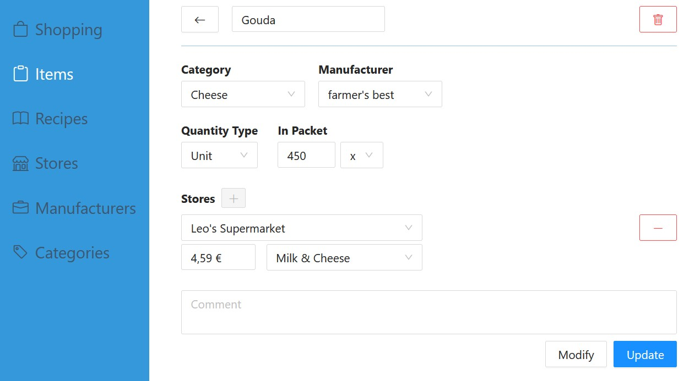
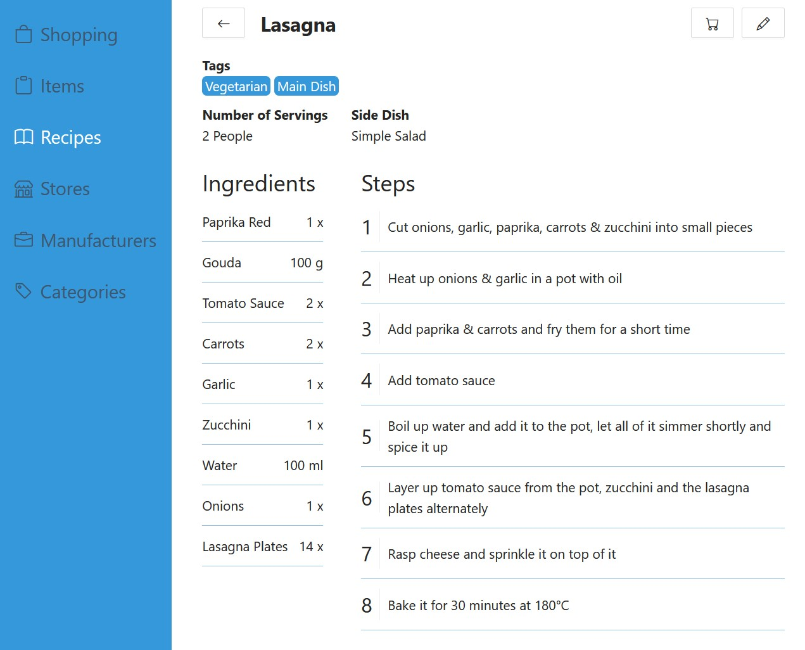
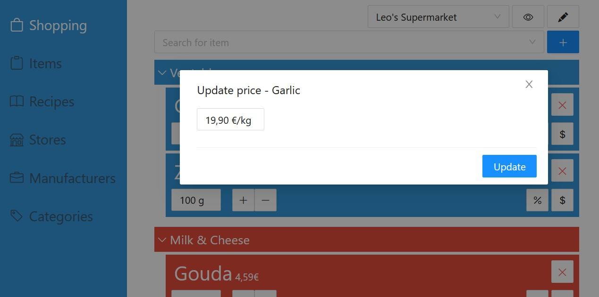
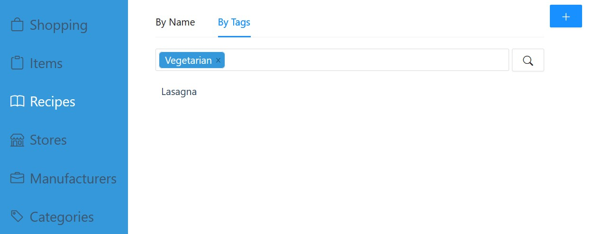

# Project Hermes - Shopping List

[](https://hub.docker.com/repository/docker/velocir4ptor/ph-shoppinglist-api)
[](https://hub.docker.com/repository/docker/velocir4ptor/ph-shoppinglist-frontend)

## Description

With the Project Hermes Shopping List you can create **shopping lists**, manage your bought **items** and collect your favorite **recipes**.
Thanks to queuing and retry logic, you don't have to worry about losing internet connection while grocery shopping - the app will **sync all changes** of your shopping list once you're online again.

### Go Shopping

Your items are **sorted conveniently** by the store's section in which they are located, so that you can take your usual stroll through the aisles and see at one glance what you need to pick up. To make it even easier, you can **hide all items in the basket** to only see what's left to buy.</br>
One of the items you needed was out of stock? No problem, the shopping list will **transfer all items** that you haven't marked as "in basket" to the next shopping list upon finishing the current one.


### Manage items

You can create simple items ...



... or register multiple types per item, so you don't have to create a separate item for every individual type.


(Modifying an item will alter the current revision, e.g. when you made a typo in the name. Updating the item will create a new revision of it, e.g. when the price changes. With this concept, you keep the item prices for previous shopping lists)

### Create Recipes

Save your best recipes along with all the ingredients and instructions




### And more

And that was just the general overview.
Because not everyone wants to have certain items permanently show up for shopping, you can also create temporary items. These will only be available for this one store until you finish the shopping list with said item in the basket or remove it from the list


Depending on the prices you saved for the items, the shopping lists predicts the estimated costs of your shopping errand. But because prices change, you can quickly adjust them from the shopping list without having to laboriously search for & open the item in the item editor.



**Search for recipes** not only by their name, but also by their tag. You'd like to eat vegetarian? Great! Search by the tag select the recipe you want to cook.



But what if you're missing some ingredients? It's tedious to add all of them to the shopping lists individually. That's why you can **add with one click** all of the ones that you're lacking to the respective store's shopping list.


And there is more on the horizon! Check out the [GitHub Milestones](https://github.com/Velociraptor45/ProjectHermes-ShoppingList/milestones) to get a glimps at what's coming soon 👀

## Setup in Docker
To run all required services in containers, Dockerfiles and docker-compose files are provided. Since v0.7.0 Docker Secrets are being used and thus the services must be started via a stack deploy on a Docker Swarm. Starting via docker-compose is not supported anymore.

### Prerequisits
Prepare the following things:
- Docker Volumes
  - Api
    - (prd/dev)-ph-shoppinglist-api-logs
    - (prd/dev)-ph-shoppinglist-api-config
  - Frontend
    - (prd/dev)-ph-shoppinglist-frontend-config
  - Database
    - (prd/dev)-ph-shoppinglist-database
- Docker Secrets
  - (prd/dev)-ph-shoppinglist-db-username
  - (prd/dev)-ph-shoppinglist-db-password
  - (prd/dev)-ph-shoppinglist-db-root-pwd

### Api
- The appsettings file (*Api/ShoppingList.Api.WebApp/appsettings.\*.json*) will not be delivered with the docker image and must be placed inside the (prd/dev)-ph-shoppinglist-api-**config** volume. Specify the following things there:
  - The DB's address and port
  - The frontend's address as an allowed origin for CORS (e.g. https://localhost:5000)

### Frontend
- Configure the webserver address & the frontend's environment in shoppinglist.conf under *Frontend/Docker* and copy it into the root directory of the (prd/dev)-ph-shoppinglist-frontend-**config**.
- Set the api's address in the respective appsettings file (*Frontend/ShoppingList.Frontend.WebApp/wwwroot/appsettings.\*.json*) and copy it into a directory of your choice on your host.

### yml files
- Under *Docker/Compose/* are yml files for development and production. You have to replace the `{CONFIG_FOLDER_PATH}` placeholder with the absolute path of the directory where your frontend's appsettings file is
- Start the containers via e.g. `docker stack deploy --compose-file docker-compose-prd.yml prd-ph-shoppinglist`

And now you're done. Happy shopping!

## Optional Setup

### https
If you don't want to run the application behind a reverse proxy that handles the certificate for you, you can also configure the application for https.

#### Api
1. Create the docker volume (prd/dev)-ph-shoppinglist-api-**tls** and uncomment the line in the docker compose file where it's mapped as a volume.
2. Generate the certificate and copy the files (\<cert-name\>.crt & \<cert-key-name\>.key) into the root directory of the (prd/dev)-ph-shoppinglist-api-**tls** volume.
3. Replace the existing kestrel http endpoint in your `appsettings.{env}.json` with an https configuration like the following or [any other valid one](https://learn.microsoft.com/en-us/aspnet/core/fundamentals/servers/kestrel/endpoints?view=aspnetcore-7.0#replace-the-default-certificate-from-configuration). Just make sure the certificate's folder matches the one to which the tls volume is mapped (Default: ssl).
    ```
    "Kestrel": {
      "Endpoints": {
        "HttpsInlineCertAndKeyFile": {
          "Url": "https://localhost:5002",
          "Certificate": {
            "Path": "ssl/<cert-name>.crt",
            "KeyPath": "ssl/<cert-key-name>.key"
          }
        }
      }
    }
    ```

#### Frontend

1. Create the docker volume (prd/dev)-ph-shoppinglist-frontend-**tls** and uncomment the line in the docker compose file where it's mapped as a volume.
2. Generate the certificate and copy the files (\<cert-name\>.crt & \<cert-key-name\>.key) into the root directory of the (prd/dev)-ph-shoppinglist-frontend-**tls** volume.
3. Replace the `shoppinglist.conf` (under *Frontend/Docker*) with:
    ```
    server {
        listen 80 default_server;
        server_name <webserver-address>; # set your webserver address here (without port)
        return 301 https://$server_name$request_uri;
    }

    server {
        listen 443 ssl;
        server_name <webserver-address>; # set your webserver address here (without port)
        
        ssl_certificate /etc/nginx/ssl/<cert-name>.crt;
        ssl_certificate_key /etc/nginx/ssl/<cert-key-name>.key;

        add_header blazor-environment "Development"; # set this to Development or Production

        location / {
            root /usr/share/nginx/html/wwwroot;
            index index.html index.htm;
        }
    }
    ```

### Frontend Logging

It is possible to collect client-side logs (e.g. exceptions). The compose files have an additional service LogCollector that must be uncommented (plus the two corresponding docker volumes). Additionally, you have to enable the LogCollector in the frontend's appsettings (`CollectRemoteLogs` section; disabled by default) and set the LogCollector's address.

### Authentication & Authorization

In order to only grant access to this application for certain users, it's possible to enable authentication & authorization with OIDC. This must be done in both frontend and api. It's disabled by default.<br/>
Currently, there is only one user role that decides over full access or no access for authenticated users. By default, it's called `User` but can be overridden by the `UserRoleName` setting in the frontend & api's `Auth` section. This role must be returned by the role claim in the ID **and** access token.

#### Frontend

Set the `Auth` section in the respective appsettings file (*Frontend/ShoppingList.Frontend.WebApp/wwwroot/appsettings.\*.json*) to `"Enabled": true` and fill the `Provider` and `User` sections.

#### API

Set the `Auth` section in the respective appsettings file (*Api/ShoppingList.Api.WebApp/appsettings.\*.json*) to `"Enabled": true` and fill the remaining properties.

### Key Vault
Instead of providing the database credentials via docker secrets, it's also possible to retrieve them from a [HashiCorp Vault](https://www.vaultproject.io/). To do so, you need the following setup (this assumes that you already have a running Vault):

- Remove the api's two DB environment variables (PH_SL_DB_USERNAME_FILE & PH_SL_DB_PASSWORD_FILE) and both username/password docker secrets from the docker compose file
- Create new docker secrets that contain the username/password with which the api will authenticate agains the vault:
  - (prd/dev)-ph-shoppinglist-vault-api-username 
  - (prd/dev)-ph-shoppinglist-vault-api-password
- Import both secrets in the docker compose file and replace the api's two DB environment variables with
  - PH_SL_VAULT_USERNAME_FILE: /run/secrets/(prd/dev)-ph-shoppinglist-vault-api-username
  - PH_SL_VAULT_PASSWORD_FILE: /run/secrets/(prd/dev)-ph-shoppinglist-vault-api-password
- Set the vault's URI in the api's appsettings files (*Api/ShoppingList.Api.WebApp/appsettings.\*.json*)
- The default mount point ((prd/dev)-ph-shoppinglist) & secret name (database) are defined in the same appsettings file and can be changed at will. But the key names inside the secret must be "username" and "password" (all lowercase) and can not be changed. Define the username and password of the user with which you want to authenticate against the database.

## Local Development Setup
To get everything running at your dev machine, at least a running dev DB is necessary. However, it's recommended to start the whole dev stack in Docker. You'll then be able to start the api & frontend locally where the frontend connects to the api and the api to the dev database.

### API

#### Database connection
To mimic Docker Secrets, there are two variables in the *Api/ShoppingList.Api.WebApp/Properties/launchSettings.json*: PH_SL_DB_USERNAME_FILE & PH_SL_DB_PASSWORD_FILE. Create two files with only username and password respectively and specify their full absolute file path in mentioned variables. A normal .txt is enough. [If you want to use the Vault, create PH_SL_VAULT_USERNAME_FILE & PH_SL_VAULT_PASSWORD_FILE variables instead in the launchSettings.json file, remove the other two and specify the location of the files holding the key vault username & password. Then, set the Vault's URI in the *Api/ShoppingList.Api.WebApp/appsettings.Local.json*.]

Also, set the DB's address and port in your *Api/ShoppingList.Api.WebApp/appsettings.Local.json*.